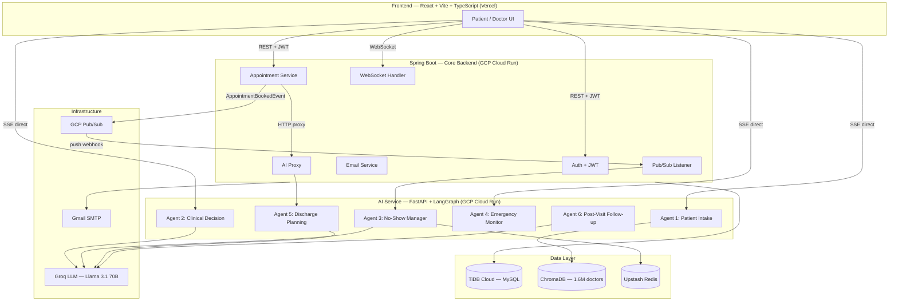
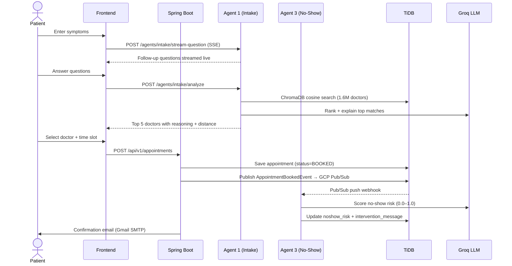
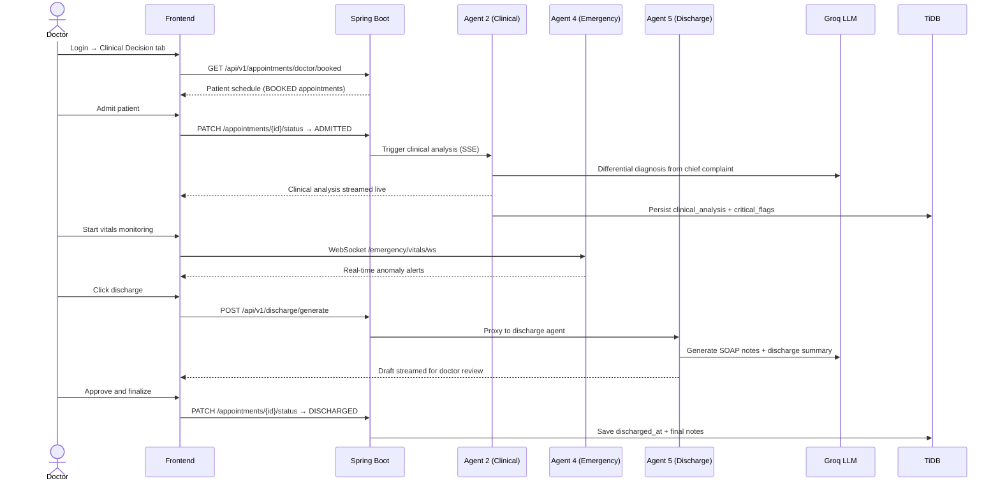
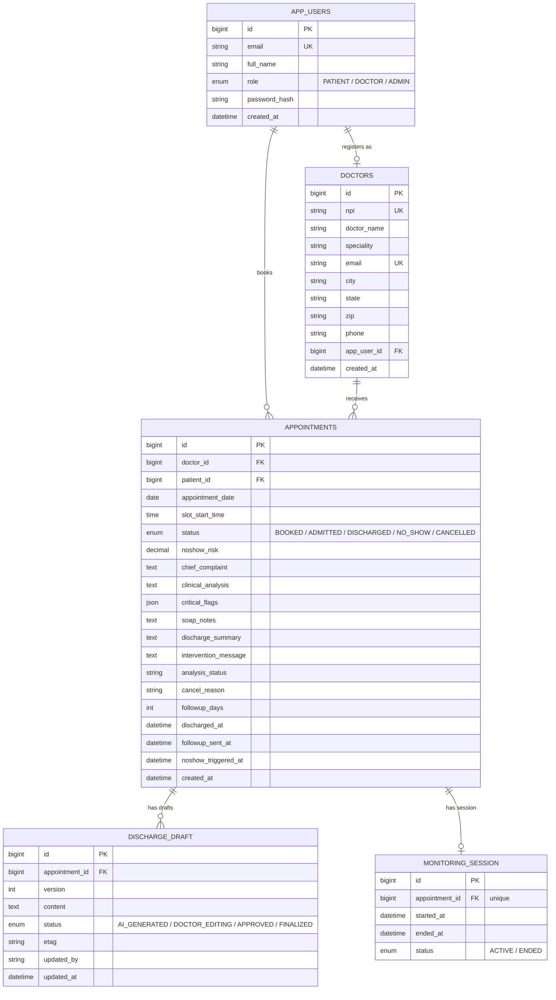

# AI Healthcare Portal

Six autonomous AI agents handling what takes hours of clinical admin work. Built to address three real problems in US healthcare: a 30% appointment no-show rate, 83 million Americans in doctor shortage zones, and doctors spending half their day on documentation instead of patients.

**Live:** [agentichealthcare.subhashpolisetti.com](https://agentichealthcare.subhashpolisetti.com)

---

## The Problems Worth Solving

| Problem | Scale | Agent response |
|---------|-------|----------------|
| No-show rate | 30% of all appointments, $150B/year lost | ML risk score on every booking → autonomous patient intervention |
| Doctor shortage | 83M Americans in federally designated shortage zones | Vector RAG across 1.6M real NPPES providers to surface accessible care |
| Clinical burnout | Doctors spend 50% of their day on paperwork | AI-generated clinical analysis, SOAP notes, and discharge summaries |

---

## System Architecture



> SSE streams (intake, clinical analysis, emergency) go **directly** from browser to the AI service — bypassing Spring Boot to avoid proxy buffering. All other REST calls go through Spring Boot.

---

## Six Agents

Each agent is a LangGraph state machine with typed state, tool-calling nodes, and conditional edges. They don't share state — each is triggered by an event and runs independently.

| Agent | Trigger | What it decides |
|-------|---------|-----------------|
| **1 — Patient Intake** | Symptom form submitted | Embeds symptoms → ChromaDB similarity search → ranks 1.6M NPPES doctors → LLM explains the match |
| **2 — Clinical Decision** | Patient admitted | Analyzes chief complaint + vitals → generates differential diagnosis → flags critical values |
| **3 — No-Show Manager** | Appointment booked (via Pub/Sub) | Scores no-show probability (0–1) → if high risk, generates and sends a personalized intervention message |
| **4 — Emergency Monitor** | Vitals stream starts | Watches rolling window of vitals readings → alerts on anomalies → persists session to survive restarts |
| **5 — Discharge Planning** | Doctor clicks discharge | Generates SOAP notes + discharge summary + follow-up instructions from clinical notes |
| **6 — Post-Visit Follow-up** | 3 days after discharge | Checks recovery progress, sends follow-up email, flags patients who may need readmission |

---

## Tech Stack

| Layer | Technology | Why |
|-------|-----------|-----|
| Core backend | Spring Boot 3 (Java 21) | JPA, event listeners, WebSocket, and scheduler — all in one runtime |
| AI microservice | FastAPI + LangGraph | Python ecosystem for ML; LangGraph for stateful multi-step agent graphs |
| Frontend | React + Vite + TypeScript | Fast HMR, strict types, minimal config |
| Database | TiDB Cloud Serverless | MySQL-compatible distributed SQL — free tier, auto-scaling, no ops |
| Vector store | ChromaDB Cloud | Cosine similarity search for doctor-symptom matching across 1.6M embeddings |
| Embeddings | all-MiniLM-L6-v2 | Runs inside the container — no embedding API cost |
| LLM | Groq (Llama 3.1 70B) | Free tier, ~10x faster inference than hosted alternatives |
| Cache | Upstash Redis | No-show dedup, session state — free 10K commands/day |
| Events | GCP Pub/Sub | Decouples appointment booking from no-show scoring pipeline |
| Deployment | GCP Cloud Run + Vercel | Both on permanent free tiers — Cloud Run: 2M requests/month, Vercel: free hobby |

---

## Patient Flow



---

## Doctor Flow



---

## ER Diagram



---

## Key Design Decisions

**Why two microservices instead of one?**  
Spring Boot handles everything that needs transactional guarantees — auth, booking, scheduling, email. FastAPI handles everything that needs Python's ML ecosystem — LangGraph, ChromaDB, sentence-transformers. Mixing them in one service would mean either running a JVM with Python (fragile) or giving up Spring's JPA and event system.

**Why SSE directly to the AI service instead of proxying through Spring Boot?**  
Spring Boot's servlet container buffers responses before forwarding. That kills streaming. SSE from the browser goes directly to the AI service on a separate port; Spring Boot only handles the non-streaming REST calls.

**Why GCP Pub/Sub for the no-show pipeline instead of a direct HTTP call?**  
The no-show scoring doesn't need to block the booking response. Decoupling via Pub/Sub means: (1) the patient gets their confirmation email immediately, (2) the scoring can retry independently if the AI service is cold-starting, (3) the appointment service doesn't care whether the AI service is up.

**Why ChromaDB for doctor matching instead of a SQL LIKE query?**  
"Patient has chest pain, shortness of breath, and fatigue" doesn't match "Cardiologist" as a keyword. Embedding the symptom description and doing cosine similarity search surfaces semantically relevant specialties — a LIKE query on specialty names would miss most matches.

---

## Local Setup

### Prerequisites
- Java 21, Python 3.11, Node 20
- TiDB Cloud account (free tier)
- Groq API key (free tier)

### Spring Boot
```bash
cd spring-backend
cp .env.local.example .env.local   # fill in TiDB + email credentials
export SPRING_PROFILES_ACTIVE=local
export $(grep -v '^#' .env.local | xargs)
./gradlew bootRun
# Runs on http://localhost:8080
```

### AI Service
```bash
cd ai-service
python -m venv venv && source venv/bin/activate
pip install -r requirements.txt
cp .env.example .env               # fill in Groq + ChromaDB credentials
APP_ENV=local uvicorn app.main:app --port 8001 --reload
# Runs on http://localhost:8001
```

### Frontend
```bash
cd frontend
npm install
# .env already set to localhost:8080 and localhost:8001
npm run dev
# Runs on http://localhost:5173
```

---

## Deployment

Both backends are containerized and deployed to GCP Cloud Run. The frontend is on Vercel.

```bash
# Spring Boot
docker build --platform linux/amd64 -t us-central1-docker.pkg.dev/PROJECT_ID/healthportal/spring-backend:latest ./spring-backend
docker push us-central1-docker.pkg.dev/PROJECT_ID/healthportal/spring-backend:latest
gcloud run deploy spring-backend --image ... --region us-central1

# AI Service
docker build --platform linux/amd64 -t us-central1-docker.pkg.dev/PROJECT_ID/healthportal/ai-service:latest ./ai-service
docker push us-central1-docker.pkg.dev/PROJECT_ID/healthportal/ai-service:latest
gcloud run deploy ai-service --image ... --port 8001 --region us-central1

# Frontend
cd frontend && npm run build && vercel --prod
```

---

## Project Structure

```
├── spring-backend/          # Spring Boot — auth, scheduling, events, WebSocket
│   └── src/main/java/com/healthcare/portal/
│       ├── appointment/     # Booking, admission, discharge, no-show sweep
│       ├── auth/            # JWT, signup, login
│       ├── doctor/          # NPPES doctor registry, slot availability
│       ├── followup/        # Scheduled post-discharge follow-up
│       ├── monitoring/      # Agent 4 session lifecycle
│       ├── pubsub/          # GCP Pub/Sub no-show push listener
│       └── vitals/          # WebSocket vitals relay
│
├── ai-service/              # FastAPI — 6 LangGraph agents, ChromaDB, Groq
│   └── app/
│       ├── agents/          # intake, clinical, noshow, emergency, discharge, followup
│       └── api/             # Route handlers, SSE endpoints
│
└── frontend/                # React + Vite + TypeScript
    └── src/
        ├── pages/           # AuthPage, BookingPage, ClinicalDecisionPage, AppointmentsPage
        └── components/      # AppHeader, AgentsStrip, AIBanner, Avatar
```
